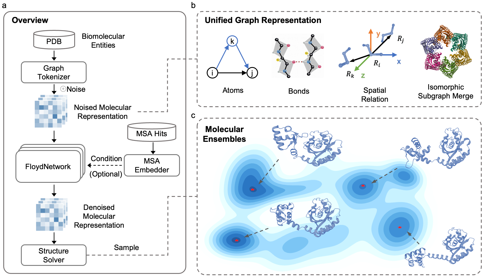

# Will release soon, please stay tune.
# OpenComplex2
OpenComplex2 ([OC2](https://www.biorxiv.org/content/10.1101/2025.05.01.651643v2)) is a generative foundation model that bridges static structure prediction and dynamic ensemble modeling of biomolecular systems. Unlike traditional structure prediction methods that focus solely on a single conformation, OC2 can efficiently sample thermodynamically relevant conformational ensembles, providing insights into molecular function that static structures alone cannot capture.




# Key Features
📊 Equilibrium Ensemble Sampling
* NMR-Validated Distributions: Accurately reproduces experimentally determined conformational ensembles
* MD-Comparable Sampling: Achieves sampling quality comparable to millisecond-scale molecular dynamics simulations at a fraction of the computational cost

🧬 High-Accuracy Structure Prediction
* State-of-the-Art Accuracy: Competitive with specialized structure prediction tools on standard benchmarks
Ultra-Large Assemblies: Efficiently models assemblies exceeding 15,000 residues through symmetry-aware optimizations
* Precise Small Molecule Modeling: Accurate stereochemical modeling of ligands and identification of multiple binding modes

# Citation
If you find our open-sourced code & models helpful to your research, please also consider star🌟 and cite📑 this repo. Thank you for your support!

```
@article{opencomplex2025towards,
  title={Towards Unraveling Biomolecular Conformational Landscapes with a Generative Foundation Model},
  author={OpenComplex Team},
  journal={bioRxiv},
  pages={2025--05},
  year={2025},
  publisher={Cold Spring Harbor Laboratory}
}
```

# Contact Information
For help or issues using the repos, please submit a GitHub issue.

For other communications, please contact Qiwei Ye (qwye@baai.ac.cn).